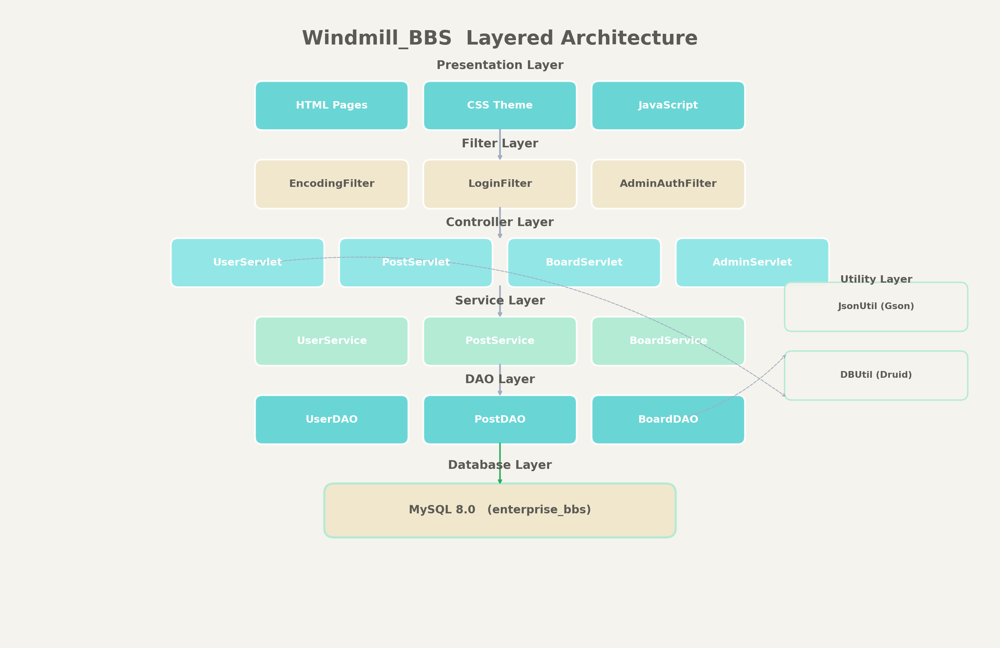
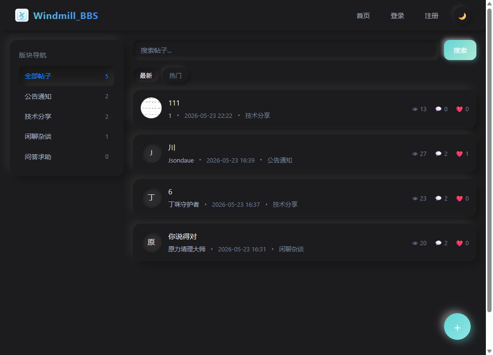
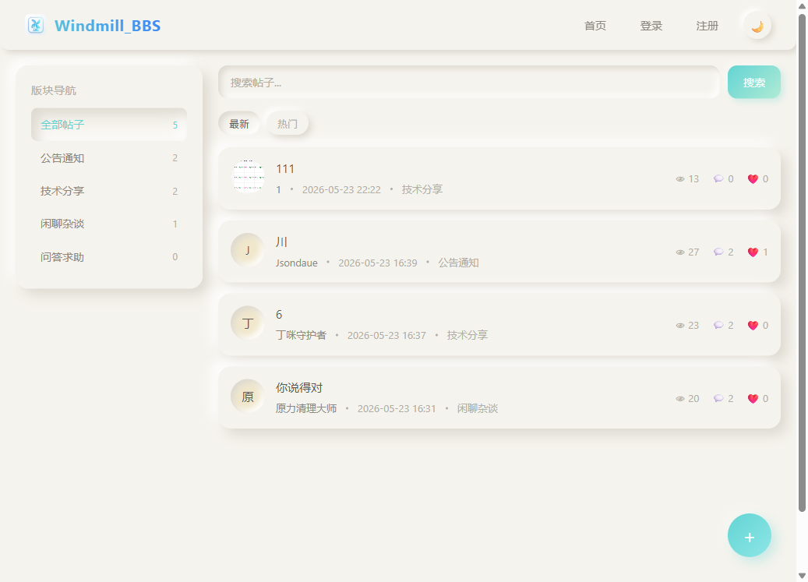

# Windmill_BBS 🌪️

> 一款支持明暗双主题的新拟物派风格企业论坛系统

<p align="center">
  
</p>

<p align="center">
  <a href="README.md">🇨🇳 中文</a> | <a href="README.en.md">🇺🇸 English</a>
</p>

---

## 📖 项目简介

Windmill_BBS 是一个基于 Java Servlet + JDBC 构建的企业级 BBS 论坛系统。前端采用纯 HTML/CSS/JS 实现，整体 UI 采用**新拟物派（Neumorphism）**设计风格，支持**浅色/暗色双主题自由切换**，配色清新柔和，交互体验流畅。

🚀 **在线预览**：https://windmillbbs-production.up.railway.app/

---

## ✨ 功能特性

### 用户端
- 🔐 **用户系统**：注册、登录、退出、个人资料管理、头像上传
- 📝 **帖子模块**：发帖、编辑、删除、搜索、点赞、置顶、加精
- 💬 **回复模块**：楼层回复、图片回复、点赞互动
- 🚨 **举报系统**：对帖子和回复进行举报，管理员后台处理
- 🎨 **双主题切换**：浅色/暗色模式一键切换，自动记忆用户偏好

### 管理端
- 📊 **后台仪表盘**：帖子管理、版块管理、举报处理
- 🛡️ **权限控制**：版块级发布权限（如"公告通知"仅管理员可发帖）
- ⚡ **帖子运营**：置顶、加精、删除等快捷操作

### UI 设计
- 🖼️ **新拟物派风格**：双重阴影、内外凹凸、柔和圆角
- 🌗 **明暗双主题**：浅色采用 #F5F3ED 暖白背景 + 青色强调，暗色采用 #1c1c1e 深色背景
- 🔍 **图片预览**：帖子与回复中的图片支持点击全屏放大查看
- ⏱️ **时间轴**：帖子详情页右侧时间轴，支持楼层定位与日期标记

---

## 🏗️ 架构设计

<p align="center">
  
</p>

项目采用经典 **MVC 分层架构**：

| 层级 | 组件 | 职责 |
|------|------|------|
| **表现层** | HTML/CSS/JS 页面 | UI 渲染、用户交互、主题切换 |
| **过滤器层** | EncodingFilter, LoginFilter, AdminAuthFilter | 编码、登录鉴权、管理员权限校验 |
| **控制层** | Servlets (User/Post/Reply/Board/Admin/Upload/Like/Report) | 请求路由、参数解析、JSON 响应 |
| **业务层** | Service 类 | 业务逻辑、事务控制 |
| **数据层** | DAO 类 | SQL 执行、结果映射 |
| **数据库** | MySQL 8.0 | 数据持久化 |
| **工具层** | DBUtil, JsonUtil, BackupTask | 数据库连接、JSON 序列化、定时备份 |

---

## 🖼️ 界面预览

### 浅色模式（Day Mode）
<p align="center">
  
</p>

### 暗色模式（Dark Mode）
<p align="center">
  
</p>

---

## 🛠️ 技术栈

| 层级 | 技术 |
|------|------|
| 前端 | HTML5 + CSS3 + JavaScript（纯原生，无框架） |
| 后端 | Java Servlet + JDBC |
| 数据库 | MySQL 8.0 |
| 连接池 | Alibaba Druid |
| 构建工具 | Maven 3.9+ |
| 服务器 | Tomcat 9.0+ |

---

## 📁 项目结构

```
Windmill_BBS/
├── src/main/java/com/enterprise/bbs/    # Java 后端源码
│   ├── controller/                      # Servlet 控制器
│   ├── dao/                             # 数据访问层
│   ├── model/                           # 实体类
│   ├── service/                         # 业务逻辑层
│   ├── filter/                          # 过滤器
│   └── util/                            # 工具类
├── src/main/webapp/                     # 前端页面
│   ├── index.html                       # 首页
│   ├── login.html                       # 登录页
│   ├── register.html                    # 注册页
│   ├── post/detail.html                 # 帖子详情
│   ├── user/home.html                   # 用户主页
│   ├── user/profile.html                # 个人中心
│   ├── admin/dashboard.html             # 管理后台
│   ├── static/css/theme.css             # 全局主题样式
│   ├── static/js/theme.js               # 主题切换脚本
│   └── uploads/                         # 上传文件目录
├── src/main/resources/                  # 配置文件
│   ├── db.properties                    # 数据库配置
│   └── init.sql                         # 数据库初始化脚本
├── pom.xml                              # Maven 配置
├── README.md                            # 项目说明
├── day.png                              # 浅色模式截图
├── dark.png                             # 暗色模式截图
└── Windmill_Icon.ico                    # 站点图标
```

---

## 🚀 快速部署

### 环境要求
- JDK 11+
- MySQL 8.0+
- Maven 3.9+
- Tomcat 9.0+

### 1. 克隆项目

```bash
git clone <仓库地址>
cd Windmill_BBS
```

### 2. 初始化数据库

编辑 `src/main/resources/db.properties`，配置你的数据库连接：

```properties
url=jdbc:mysql://localhost:3306/enterprise_bbs?useUnicode=true&characterEncoding=utf-8&serverTimezone=Asia/Shanghai&useSSL=false&allowPublicKeyRetrieval=true
username=root
password=你的密码
```

执行初始化脚本：

```bash
mysql -u root -p < src/main/resources/init.sql
```

> 若已存在数据库，仅需执行：
> ```sql
> ALTER TABLE t_board ADD COLUMN post_permission TINYINT NOT NULL DEFAULT 0;
> UPDATE t_board SET post_permission = 1 WHERE board_name = '公告通知';
> ```

### 3. 编译打包

```bash
mvn clean package
```

打包成功后，会在 `target/` 目录下生成 `enterprise-bbs.war`。

### 4. 部署到 Tomcat

将 WAR 包复制到 Tomcat 的 `webapps` 目录：

```bash
cp target/enterprise-bbs.war $TOMCAT_HOME/webapps/
```

启动 Tomcat：

```bash
$TOMCAT_HOME/bin/startup.bat   # Windows
$TOMCAT_HOME/bin/startup.sh    # Linux/Mac
```

### 5. 访问系统

打开浏览器访问：

```
http://localhost:8080/enterprise-bbs/index.html
```

默认管理员账号：`admin` / `admin123`

---

## ⚠️ 注意事项

1. **上传文件目录**：用户上传的图片默认存储在 Tomcat 部署目录的 `uploads/` 文件夹下。重新部署 WAR 包时，**请先备份该目录**，否则历史图片会丢失。

2. **推荐做法**：在 `server.xml` 中配置虚拟目录，将 uploads 映射到 Tomcat 外部路径：
   ```xml
   <Context docBase="D:/bbs-uploads" path="/enterprise-bbs/uploads" />
   ```

---

## 📄 开源协议

本项目仅供学习交流使用。

---

<p align="center">
  <a href="README.md">🇨🇳 中文</a> | <a href="README.en.md">🇺🇸 English</a>
</p>
